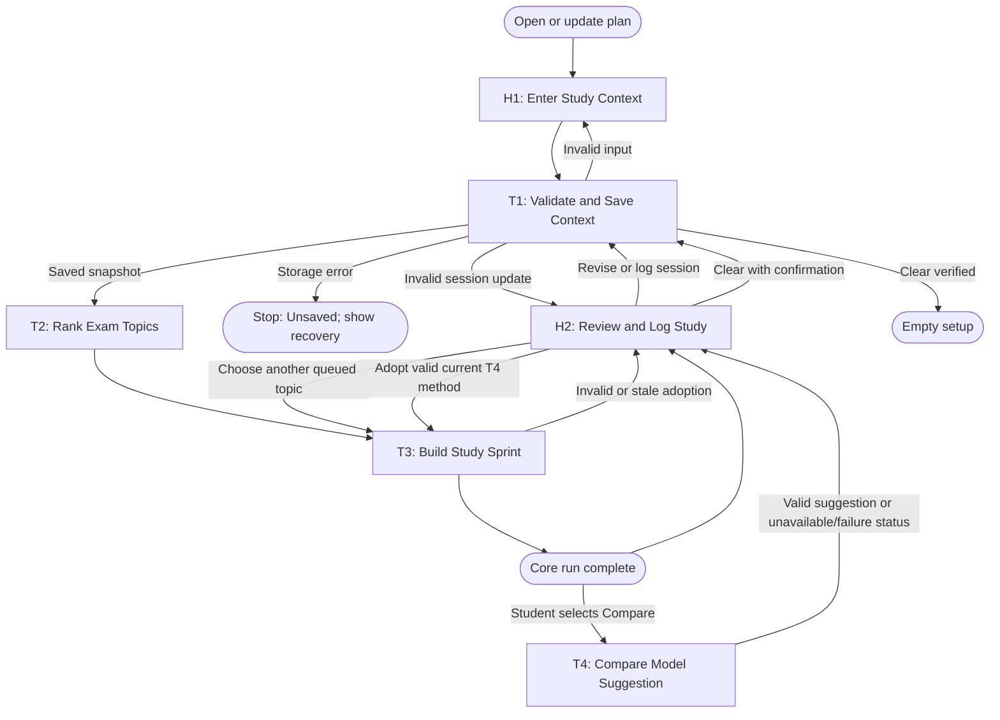

# Workflow of Tasks

## 1. Workflow Overview

### 1.1 Workflow Goal

This workflow supports the system goal in the repository [README](../README.md).

### 1.2 Workflow Trigger

The student starts or revises a plan by entering exam details, changing a topic, or logging a study session. The student separately triggers **Compare a model suggestion** for the current saved sprint when a provider is configured. Opening the app loads saved local state, refreshes days remaining, and applies the fixed ranking to saved topic facts without making a provider call. The passage of a day alone does not change a topic's priority index.

### 1.3 Completion Condition at Runtime

A core run is complete when valid input has been saved and read back, unfinished topics have been ranked using the current values, and a study sprint and its reasons are visible. If there are no topics, show an empty state and an input action rather than a recommendation. Invalid required input leaves the previous saved version intact and asks for a specific correction. A local storage failure leaves the run incomplete and visible as unsaved. The optional model-comparison request has its own success, unavailable, or failed status and does not rewrite core-run completion.

### 1.4 General Workflow

**H1: Enter Study Context** supplies one upcoming exam and up to six topics. **T1: Validate and Save Context** checks fields and persists a versioned snapshot to local storage. A missing or invalid required value returns to H1. **T2: Rank Exam Topics** applies the fixed rules, displays up to three top unfinished topics with their input evidence and any honest shortfall, and retains the remaining topics. **T3: Build Study Sprint** uses the leading topic, available minutes, and exam format to propose a bounded session with a method and time allocation. It writes the current result and reads it back. If there are no unfinished topics, it shows a completion/empty view.

**H2: Review and Log Study** lets the student follow the suggestion, choose a different topic, revise inputs, mark a topic done reviewing, or log a session. A logged session records actual minutes and the student's new confidence, then starts a new T1 → T2 → T3 run. The student may ask to clear all local data after a confirmation; T1 clears the local record and checks that it is gone before returning to the empty setup. **T4: Compare Model Suggestion** is reached only when the student selects that action for the current result. It calls one configured provider at most once for that click, validates a proposed method, and shows it separately. A missing key, model error, or invalid answer shows a specific status while the core sprint stays available. T4 has no side effects beyond saving its own result/status. If the student explicitly adopts a valid T4 method, H2 sends the method, selected topic, and context version to T3. T3 validates that the suggestion still belongs to the current saved sprint, saves a new sprint revision showing the student override and original default, and leaves rank, time, and progress unchanged. A stale or invalid adoption leaves the saved sprint intact and returns to H2 with a recovery message. No task sends a message or alters course records.

### 1.5 Workflow Diagram

## 2. Feature groups

1. **Group 1 — Working local study loop:** H1, T1, T2, T3, H2, local data, and the visible browser interface. Verify normal, empty, invalid-input, storage-failure, update, and reload journeys.
2. **Group 2 — Optional model comparison:** T4 with one provider whose access is available to the person running that copy. An instructor can demonstrate Jev using their own backend key; students without Jev access may select OpenAI or Claude if they have access, or leave Group 2 unconnected. Do not share the instructor key with student copies. Verify one bounded live request only after its access and test scope are approved.
