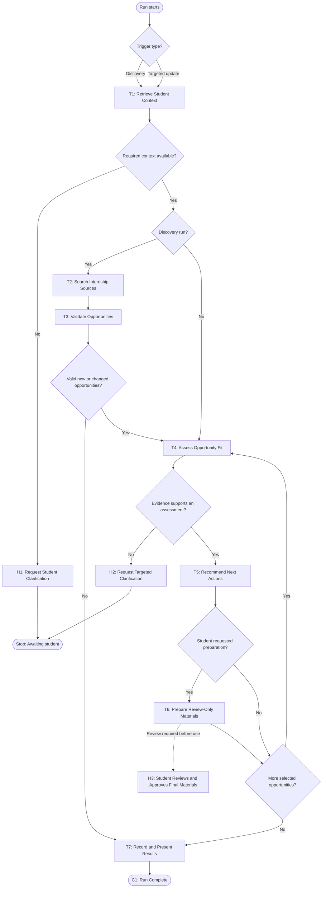

# Workflow of Tasks

> **Worked example:** This file shows one completed version of the Week 2 `workflow-of-tasks.md` template for the Internship Application Prep Agent.

## 1. Workflow Overview

### 1.1 Workflow Goal

This workflow supports the system goal defined in `my_first_agent/README.md`.

### 1.2 Workflow Trigger

A discovery run begins when the student selects **Collect Opportunities** or when a daily schedule previously approved by the student triggers the same bounded search. A targeted update begins when the student supplies requested information or asks for review-only preparation for one already tracked opportunity; a targeted update does not start a new internship-market search.

### 1.3 Completion Condition at Runtime

The run is complete when the bounded search, if applicable, has stopped; every selected opportunity has an evidence-backed assessment and next-action recommendation; any student-requested draft has either been prepared for review or recorded as unresolved; permitted record changes have been checked; unresolved issues have a named next step or student handoff; and the student can see the run summary. Completion never means that an application was submitted.

### 1.4 General Workflow

The system first performs **T1: Retrieve Student Context** to load the verified student profile, preferences, constraints, tracked opportunities, and any new student response. During a discovery run, it then performs **T2: Search Internship Sources**, using no more than three targeted public-web searches and screening no more than 15 candidate opportunities. **T3: Validate Opportunities** checks source evidence, required fields, initial relevance, hard constraints, and duplicates. It retains three to five valid new or materially changed opportunities when at least three qualify, never retains more than five, and does not add weak opportunities merely to reach the target. For each retained opportunity, **T4: Assess Opportunity Fit** compares posting requirements with verified student evidence, constraints, and preferences and identifies matches, gaps, and unknowns. **T5: Recommend Next Actions** uses that assessment to recommend prioritizing, monitoring, preparing, following up, archiving, or asking the student for input. A targeted update skips the market-search tasks and moves from T1 to T4 using the tracked posting evidence and the student's new response.

If the student explicitly requests preparation, **T6: Prepare Review-Only Materials** creates an evidence-grounded checklist, outline, or question worksheet with visible placeholders. The draft remains under a student review gate and cannot be treated as final or used in an application without the student's approval. After every selected opportunity has been handled, **T7: Record and Present Results** writes only permitted collection changes, checks the recorded result, and shows the student the decisions, evidence, drafts, and unresolved issues. If required evidence is missing or conflicting, the system asks a specific question and stops while awaiting the student rather than guessing. If no opportunity qualifies within the search limits, T7 records the shortfall and completes the run. The system does not submit applications, finalize materials, or contact employers.

### 1.5 Workflow Diagram

