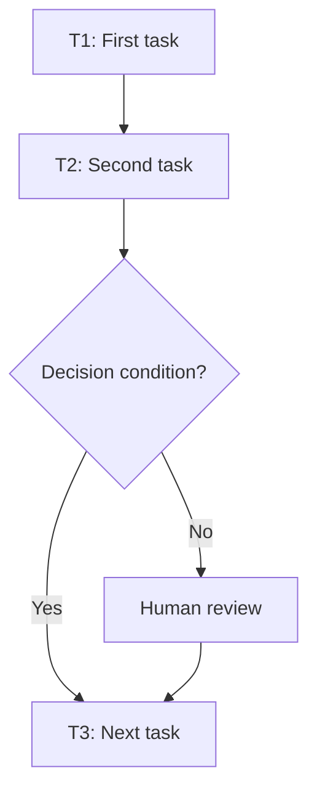

# Workflow of Tasks

*Replace all bracketed prompts with information specific to your proposed system. Delete instructional text that does not belong in your final specification. Add or remove task sections as needed. Every task shown in the general workflow must have a corresponding task specification below.*

## 1. Workflow Overview
### 1.1 Workflow Goal
This workflow supports the system goal defined in `my_first_agent/README.md`.

### 1.2 Workflow Trigger

[Describe the event, request, schedule, or condition that starts the workflow.]

### 1.3 Completion Condition

[Describe how the system knows that the workflow has been completed successfully.]

### 1.4 General Workflow

[Describe the overall sequence of tasks in one or two paragraphs. Explain the normal path first, followed by the most important exception paths and human-review points.]

### 1.5 Workflow Diagram

[Insert a flowchart showing the tasks in sequence. Label each task with a task number and short name. Show decision branches, loops, human-review points, and possible stopping conditions. Below is an example of a Mermaid. You can either edit the mermaid below yourself or ask ChatGPT to generate a Mermaid script for you. Give every task a unique ID, such as T1, T2, and T3, and name tasks using a verb and an object in the mermaid.]

## 2. Detailed Task Specifications

Copy the following section once for **each** task in the workflow.

---

### Task [T#]: [Task Name]

#### A. Purpose

[Explain what this task accomplishes.]

#### B. Task Type

- **Primary type:** [Retrieve / Sense / Reason / Decide / Act / Verify / Remember / Learn]

#### C. Trigger and Preconditions

- **Trigger:** [What starts this task?]
- **Preconditions:** [What must already be true or available?]
- **Task owner:** [System / Human / System with human approval]

#### D. Inputs

| Input | Source | Format | Required? | Validation or Quality Requirement |
|---|---|---|---|---|
| [Input name] | [Source or preceding task] | [Format] | [Yes/No] | [Requirement] |

#### E. Processing Instructions

1. [Describe the operation(s) required.]
3. [State the applicable rule, criterion, calculation, or tool.]
4. [Explain how uncertainty, missing information, or conflicting evidence is handled.]

#### F. Outputs

| Output | Format | Used By or Stored In | Quality Requirement |
|---|---|---|---|
| [Output name] | [Format] | [Next task, human, or storage location] | [Requirement] |
