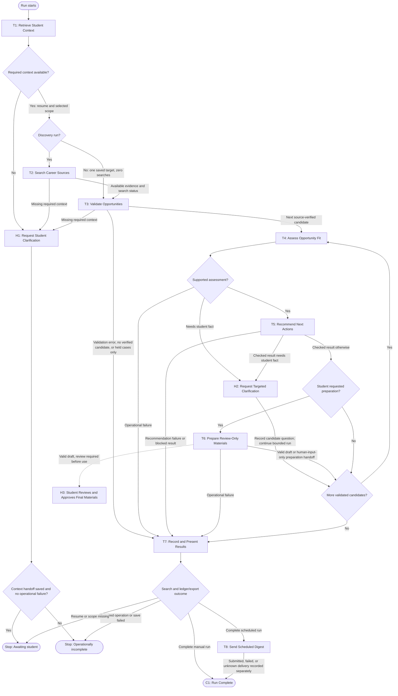

# Workflow of Tasks

> **Worked example:** This file shows one completed version of the Week 2 `workflow-of-tasks.md` template for the Career Opportunity Prep Agent.

## 1. Workflow Overview

### 1.1 Workflow Goal

This workflow supports the system goal defined in `my_first_agent/README.md`.

### 1.2 Workflow Trigger

A discovery run begins when a signed-in student selects **Collect Opportunities** in the shared Codex Site or when a student-configured daily or weekly schedule triggers the same bounded search. The student first uploads a resume to private Supabase storage, reviews an editable resume summary, revises it if needed, confirms the final text, and selects role interests, timeframe, and role types (internships, entry-level jobs, or both), which are versioned with each run. The Site derives the student's owner identity server-side; each private resume, ledger entry, question, draft, and export is accessible only to that owner. An instructor-operated Supabase Cron trigger invokes a narrowly scoped Edge Function to claim due schedules from stored student settings; the trigger supplies no search terms or recipient. A scheduled run uses the last approved scope; a missing or changed scope pauses for student confirmation. A run lock prevents overlapping manual/scheduled writes; a trigger arriving during a run is recorded as skipped, not silently queued or duplicated. A missed or delayed trigger is visible and never counts as a completed run or sent digest. A targeted update begins when the student answers a saved question or requests preparation for one tracked opportunity. It identifies exactly one persisted opportunity or candidate and passes through T3 validation with zero discovery searches. Only a scheduled discovery run with a confirmed recipient can reach T8 email delivery.

The Site provides separate My setup, Opportunities, Preparation, and Schedule pages with direct URLs. **Start a new setup** preserves saved history and downloads, rejects stale-tab writes, and blocks new searches until the new setup is confirmed. The separate **Reset all my data** control shows the student's deletion summary and requires typing RESET. It permanently removes that student's saved setup, resumes, runs, opportunities, answers, archive history, generated materials, and hosted files. The sign-in identity remains; previously downloaded device files are outside its scope. An active request blocks deletion. An unfinished deletion blocks other workspace actions until the student explicitly continues the same reset.

### 1.3 Completion Condition at Runtime

Determine the search-and-record outcome in this order: incomplete because of an operational error if a required automated operation or hosted ledger/export read-back failed; otherwise awaiting student if the resume or search scope needed to start is missing; otherwise complete when the bounded search, if applicable, ended without a search-service or systemic failure, every processed candidate has a traceable scored, needs-student-information, source/technical, or excluded disposition, permitted owner-scoped ledger changes and the versioned `.xlsx` snapshot are confirmed by read-back, and the student can see both result groups and shortfalls. A successful empty discovery or one with individually skipped inaccessible pages may complete with visible source coverage. A needs-information group, pending H3 draft review, or a recorded student preparation question does not by itself block completion; the affected opportunity remains pending. Technical preparation failure makes the run operationally incomplete. T8 delivery has its own submitted, failed, or unknown status after hosted ledger/export verification; an email failure does not rewrite a completed search as successful delivery. Completion never means an application was submitted.

### 1.4 General Workflow

The system first performs **T1: Retrieve Student Context** to accept the original resume, prepare an editable source-derived summary for student revision and confirmation, and load the selected timeframe, role types, preferences, constraints, owner-scoped hosted opportunity history, and any new response. During discovery, **T2: Search Career Sources** uses the approved reference file and accessible, permitted public or authorized routes, with at most eight fixed discovery API requests, eight reserved hosted-search calls, 40 screened leads, and 24 application-controlled posting-page reads. The controller fixes source order, search intent, and domain filters. OpenAI hosted search may formulate internal queries; observed queries are logged, and unavailable internal details remain unknown rather than being reported as an exact query count. It records every named source as used, attempted, skipped, restricted, or inaccessible, without promising all eight will be searched. One denied or unreadable page is counted and skipped; a systemic search failure stops retrieval. **T3: Validate Opportunities** deduplicates and checks employer/role identity, chosen timeframe and role type, explicit hard conflicts, and an employer career/authorized ATS posting or official currently open USAJOBS announcement. Job-board listings alone remain unverified leads. It passes source-verified candidates with missing personal facts to **T4: Assess Opportunity Fit**, while source failures go to a separate queue. T4 compares distinct posting criteria with the confirmed resume summary and other confirmed student facts and calculates an evidence-backed 1–5 score or provisional range; absence from a resume is unknown, not a gap. A material user-answerable unknown goes to **H2: Request Targeted Clarification** for that candidate while the bounded run continues. **T5: Recommend Next Actions** explains each completed assessment and may recommend resume refinement, cover-letter drafting, or interview practice without executing those steps. A targeted update skips T2 and moves T1→T3→T4 for one saved target with zero discovery searches.

If the student explicitly requests preparation for one opportunity, **T6: Prepare Review-Only Materials** creates a versioned, evidence-grounded resume refinement/tailoring draft, tailored cover-letter draft, or interactive interview-question flip cards, with visible placeholders and student review under H3. **T7: Record and Present Results** ranks only assessments stable under material user-answerable unknowns, shows up to three to five top scored summaries and a separate two to three promising summaries needing a specific student answer, and shows honest shortfalls when fewer qualify. It writes every screened opportunity and disposition to the student's versioned Supabase job ledger, creates a downloadable `.xlsx` snapshot, verifies both by read-back, and shows source coverage, score evidence, links, questions, and next steps. Earlier snapshots remain available; a scheduled run does not update a file previously downloaded to the student's device. Held candidates and unverified sources never become scored recommendations. H1 persists missing resume/scope questions in a separate owner-scoped record when the opportunity ledger cannot load. After a successful scheduled discovery write and export check, **T8: Send Scheduled Digest** emails the configured student recipient a formatted summary of both groups with links and delivery status; no resume text or draft attachment is sent. A later answer or preparation request starts a new bounded targeted run. The system does not submit applications, finalize materials, or contact employers.

### 1.5 Workflow Diagram

Outside a run, the student can archive selected opportunities or all currently visible opportunities after reviewing the selection, and restore them from the Archived view. These owner-scoped visibility changes preserve prior assessments, answers, drafts, and spreadsheet snapshots. They do not start discovery, reassessment, or preparation. Start a new setup keeps the opportunity history. Only the separately confirmed Reset all my data operation permanently clears it, along with the other student-owned records and hosted files described above.

```mermaid
flowchart TD
    S0([Run starts]) --> T1["T1: Retrieve Student Context"]
    T1 --> D1{"Required context available?"}
    D1 -->|No| H1["H1: Request Student Clarification"]
    H1 --> DH{"Context handoff saved and no operational failure?"}
    DH -->|Yes| E1([Stop: Awaiting student])
    DH -->|No| E2([Stop: Operationally incomplete])
    D1 -->|Yes: resume and selected scope| D2{"Discovery run?"}
    D2 -->|Yes| T2["T2: Search Career Sources"]
    D2 -->|No: one saved target, zero searches| T3["T3: Validate Opportunities"]
    T2 -->|Available evidence and search status| T3
    T2 -->|Missing required context| H1
    T3 -->|Missing required context| H1
    T3 -->|Validation error, no verified candidate, or held cases only| T7["T7: Record and Present Results"]
    T3 -->|Next source-verified candidate| T4["T4: Assess Opportunity Fit"]
    T4 --> D4{"Supported assessment?"}
    D4 -->|Needs student fact| H2["H2: Request Targeted Clarification"]
    H2 -->|Record candidate question; continue bounded run| D6{"More validated candidates?"}
    D4 -->|Operational failure| T7
    D4 -->|Yes| T5["T5: Recommend Next Actions"]
    T5 -->|Recommendation failure or blocked result| T7
    T5 -->|Checked result needs student fact| H2
    T5 -->|Checked result otherwise| D5{"Student requested preparation?"}
    D5 -->|Yes| T6["T6: Prepare Review-Only Materials"]
    T6 -. Valid draft, review required before use .-> H3["H3: Student Reviews and Approves Final Materials"]
    T6 -->|Valid draft or human-input-only preparation handoff| D6
    T6 -->|Operational failure| T7
    D5 -->|No| D6
    D6 -->|Yes| T4
    D6 -->|No| T7
    T7 --> DS{"Search and ledger/export outcome"}
    DS -->|Required operation or save failed| E2
    DS -->|Resume or scope missing| E1
    DS -->|Complete manual run| C1([C1: Run Complete])
    DS -->|Complete scheduled run| T8["T8: Send Scheduled Digest"]
    T8 -->|Submitted, failed, or unknown delivery recorded separately| C1
```
