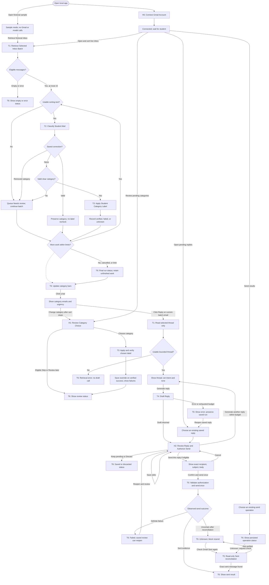

# Workflow of Tasks

## 1. Workflow Overview

### 1.1 Workflow Goal

This workflow supports the system goal in [../README.md](../README.md): organize a student-requested window of Gmail messages and prepare an editable reply to one selected message. Category and urgency rules are in [../docs/category-policy.md](../docs/category-policy.md).

### 1.2 Workflow Trigger

Connecting through **H0: Connect Gmail Account** establishes access. It does not retrieve the inbox, sort mail, or draft a reply. The new-reply journey is:

1. Click **Open & sort live inbox** beside Connect/Disconnect. T1 retrieves metadata for at most the 15 newest inbox messages and bounded sorting text for eligible records. T2/T3 sort and label clear results without another confirmation.
2. Click a category bar to reveal its email cards and urgency estimates. No cards appear before selection; **Clear selection** hides them again. Results accumulate while sorting runs.
3. Click **Reply** on an email in the current retrieved batch. T1 retrieves and displays up to three thread messages ending at that selected message. It does not generate a draft.
4. Enter an intended answer or select **Acknowledgment only**, adjust the Professional-to-Warm slider, and click **Generate reply** to start T4.
5. Review the editable draft and save any changes. **Send this reply** opens the final confirmation; only **Confirm and send once** authorizes and invokes T5.

**Review pending categories**, **Open pending replies**, and **Send results** reopen saved records for the selected account and mode. Saved reply review uses stored context without a new inbox retrieval. Sample mode is available without Gmail and simulates sorting, drafting, labels, and sending. Connection alone, timers, incoming mail, and model decisions never start a run.

### 1.3 Completion Condition at Runtime

A sorting run stops after its eligible window of at most 15 messages, 30 sorting-model attempts including retries, 10 minutes measured from sorting-text preparation, or cancellation. The ten-minute deadline gates further model/label processing, not a hard cutoff of sequential text preparation or an in-flight request. Cancel remaining work is available during processing after text preparation. Remaining items are unprocessed; completed label operations are retained. Pending decisions and label failures remain reviewable. Interrupted runs do not automatically resume after restart; opening the inbox starts a new run.

A reply run permits three drafting-model attempts, including retries and requested redrafts. It may remain saved, be discarded, or reach sent, failed, or unknown send status. A definite failure permits fresh review and confirmation. An unknown outcome permits read-only Sent reconciliation and blocks resending that run. These are individual action outcomes; the app remains available.

### 1.4 General Workflow

**Sorting and category review.** T1 retrieves one newest inbox window without an older-page cursor, then bounded plain text for successfully retrieved metadata records. Missing sorting text enters Needs review without a model call. T2 validates category and urgency independently. Without a saved correction, a clear category goes to T3; uncertain/invalid decisions enter the H1 queue while the batch continues. A valid saved correction retains its category while T2 estimates urgency: this branch does not rewrite or recheck Gmail labels. A removed category ID requires review.

T3 changes only registered app-owned category labels and reads back the result. H1 accepts corrections after sorting stops, including saved pending items. Selecting a category invokes T3 immediately, without another confirmation. A durable override is saved only after verified live labeling or successful fictional simulation. Skip is available only for an unresolved item with no label operation started; Review later preserves unresolved work. Explicit H1 actions can initiate a new bounded label operation after a cancelled or finished sort.

**Replying.** T1's reply entry validates membership in the current retrieved batch and reads only the selected thread. Replying does not require a clear category or successful label. Saved pending categories outside the current batch cannot start a new reply until retrieved again. T4 needs usable text, intent or acknowledgment-only choice, tone, and the student's Generate action. It produces body text and missing-fact questions without selecting recipients or accessing Gmail. Redrafting reuses saved context within the same attempt budget.

H2 shows the thread reference, fixed subject, recipient choice, and editable body. Generated drafts are already saved; edits must be saved before sending. Save edits and Keep pending grant no send authority. Multiple Reply-To addresses require one choice; invalid/self recipients and unresolved placeholders block send. The final dialog shows exact recipient, subject, and body. Cancel returns to review; a no-reply address requires acknowledgment. Confirm and send once creates a five-minute, one-use authorization bound to saved account, thread, recipient, and revision. T5 validates and consumes it before one send. A successful Gmail response with message ID and matching thread is sent evidence; uncertain responses trigger bounded read-only Sent reconciliation. No automatic resend occurs.

**Presentation and recovery.** T6 shows animated category bars beside the urgency panel and reports evidence from T3/T5. Current-batch cards are ordered by urgency with unavailable scores last. Needs review also groups unresolved label results and unprocessed items; saved pending queues retain saved-record ordering. T6 does not independently relabel or send. Errors expose the affected action and recovery control. Disconnect removes local credentials and attempts revocation; saved account-scoped review records remain. Restarted in-flight sends become unknown. Mail and model output are untrusted task data; the app does not archive, delete, mark read, forward, or automatically reply.

### 1.5 Workflow Diagram

This is one connected workflow. The main path continues from inbox sorting to a reply only when the student clicks **Reply** on a current-batch email. The saved-work branches resume an existing category review, reply, or send result.

The sample entry bypasses H0 and substitutes fictional records and simulated operations. Saved reply review/redrafting uses stored thread text without repeating T1. There is no connection-to-new-draft shortcut.

## 2. Task Contracts

Each task and human gate has one specification linked from [task-summary.md](task-summary.md). T1 has two entry points: newest-inbox and selected-thread retrieval. T2/T3 repeat over eligible messages; H1 resolves later corrections and exceptions. T6 presents progress and outcomes throughout. Saved work is scoped by mode and account with stable run/message IDs and revisions. T5 never repeats a send automatically.
